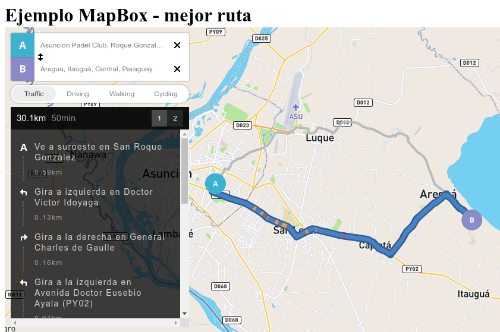

# Live coding: Mejor ruta entre dos puntos usando MapBox
Se muestra en un live como implementar la mejor ruta entre dos puntos usando la librería y servicios de MapBox.
El video se encuentra en YouTube [https://www.youtube.com/watch?v=hH5E6fCl0bc](url){:target="_blank"}

## Screenshots

## Herramientas de desarrollo
* Librería de mapas: MapBox https://www.mapbox.com/)
* Lenguajes de programación: HTML, CSS y JavaScript

## Documentaciones útiles
* https://docs.mapbox.com/
* https://docs.mapbox.com/mapbox-gl-js/api/
* https://docs.mapbox.com/api/navigation/#directions
* https://github.com/mapbox/mapbox-gl-directions
* https://github.com/mapbox/mapbox-gl-directions/blob/master/API.md
